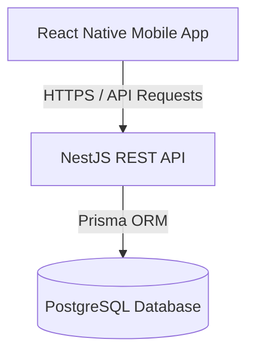

# EcivreS

## Overview
EcivreS is a mobile-first local-services marketplace.

## Features
- Customer & Service Provider roles in a unified mobile application
- REST API powered by NestJS and PostgreSQL
- Role-Based Access Control (RBAC) architecture
- JWT-based authentication (fully implemented with refresh token rotation and secure token storage via React Native Keychain)
- Booking and service request lifecycle
- Payments, reviews, and notifications structure

## Architecture
This project uses a Modular Monolith architecture to ensure simplicity and maintainability for a small development team, while keeping the door open for future microservices scaling.



## Tech Stack
- **Frontend**: React Native, Expo, Expo Router, NativeWind, Zustand
- **Backend**: NestJS, Prisma, PostgreSQL, JWT
- **DevOps**: Docker, GitHub Actions CI/CD

## Prerequisites
- Node.js >= 20
- pnpm >= 9
- Docker & Docker Compose
- Java / Android Studio (for Android build)
- Expo CLI

## Environment Setup
Copy the environment template:
```bash
cp .env.example .env
```

## Running Locally
1. Start the database:
   ```bash
   pnpm docker:up
   ```
2. Run database migrations:
   ```bash
   pnpm db:migrate
   ```
3. Start the API:
   ```bash
   pnpm dev:api
   ```
4. Start the Mobile App:
   ```bash
   pnpm dev:mobile
   ```

## Deployment
Dockerization is available for the API backend via `apps/api/Dockerfile`.
Mobile deployment profiles are configured for Expo EAS.
