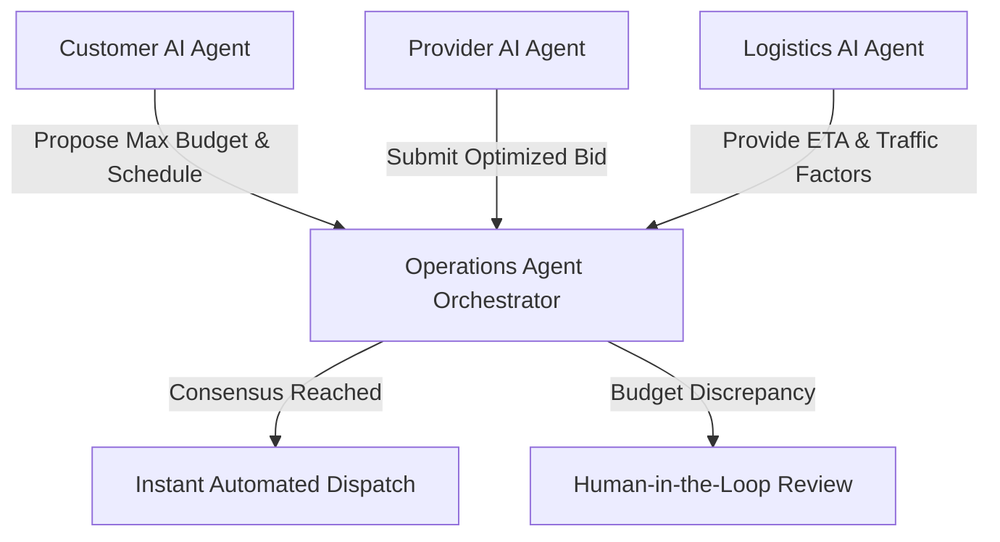

# AI Multi-Agent Collaboration & Consensus Protocol Architecture

## Overview
The EcivreS Multi-Agent Ecosystem orchestrates autonomous decision-making between Customer AI Agents, Provider AI Agents, Logistics AI Agents, and Operations AI Agents to negotiate pricing, optimize schedules, and resolve booking dispatch without human latency.

## Agent Roles
- **Customer Agent**: Learns scheduling preferences, budget ceilings, and service history.
- **Provider Agent**: Maximizes earnings, minimizes deadhead transit, and bids dynamically.
- **Logistics Agent**: Computes real-time fleet ETA and route feasibility.
- **Operations Agent**: Enforces consensus rules and flags edge cases for human review.
