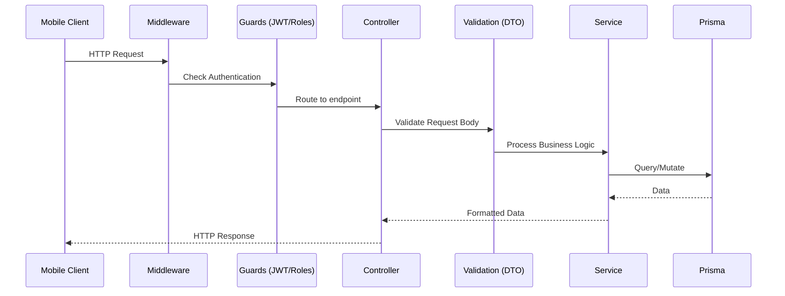

# Backend Architecture

The backend is a monolithic REST API built using NestJS. It follows a highly modular domain-driven structure.

## Request Lifecycle

## Key Components

### 1. Modules (`apps/api/src/modules/`)
The application is split into domain modules: `auth`, `users`, `roles`, `permissions`, `providers`, `customers`, `services`, `bookings`, `payments`, `reviews`, `notifications`, `admin`.

### 2. Controllers
Controllers handle HTTP routing, extract parameters (e.g., `@Body()`, `@Param()`, `@CurrentUser()`), and pass them to Services. They are decorated with Swagger decorators for documentation.

### 3. Services
Services contain all business logic. They are strictly decoupled from the HTTP transport layer and communicate with the database by injecting the `PrismaService`.

### 4. Guards
- **`JwtAuthGuard`**: Uses Passport's JWT strategy to validate tokens and block unauthenticated requests.
- **`RolesGuard` / `PermissionsGuard`**: Evaluates the roles/permissions attached to the authenticated user object to enforce RBAC.

### 5. DTOs (Data Transfer Objects)
Classes decorated with `class-validator` (e.g., `@IsEmail()`, `@IsString()`) to ensure incoming request payloads are strictly validated before hitting the service layer.

### 6. PrismaService
A global module (`apps/api/src/prisma/prisma.service.ts`) that manages the connection to PostgreSQL using the `@prisma/adapter-pg` driver adapter.
