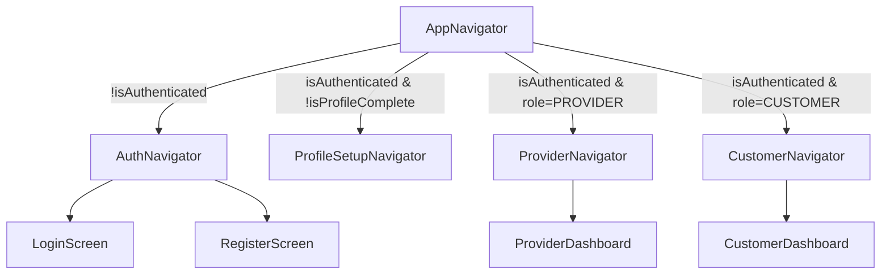

# Frontend Architecture

The mobile application is built using React Native and uses a modular folder structure.

## Application Entry Point
The application starts at `apps/mobile/App.tsx` (implicitly) and mounts the `AppNavigator.tsx`.

## Navigation Architecture
Routing is handled by React Navigation. The app uses conditional rendering based on authentication state to protect screens.

## State Management
Global state is managed by Zustand in `apps/mobile/src/stores/`.
- **`authStore.ts`**: Manages `user`, `isAuthenticated`, and `isProfileComplete`. It hydrates state from `AsyncStorage` on app launch via `restoreSession()`.

## API Services & Networking
Network requests are handled by Axios in `apps/mobile/src/services/api/`.
- **`client.ts`**: Configures the base Axios instance to point to the backend URL (`http://localhost:5000/api/v1` or `EXPO_PUBLIC_API_URL`).
- **`interceptors.ts`**: Contains the critical logic to intercept requests and inject the `Authorization: Bearer <token>` header, as well as detecting `401 Unauthorized` responses to automatically trigger the refresh token flow.
