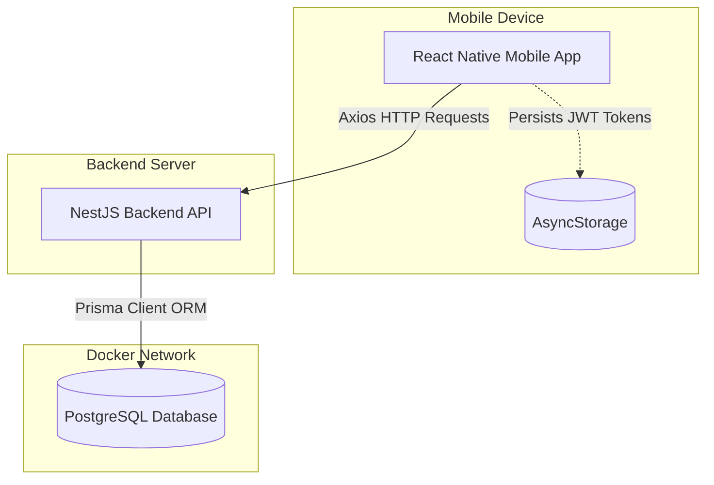

# System Architecture

The EcivreS application follows a standard client-server architecture using a monorepo setup to share configurations.

## High-Level Architecture Diagram

## Layers of the System

### 1. Frontend (Mobile App)
Built with React Native, this layer is responsible for the user interface, navigation flows, local state management (Zustand), and presenting forms to the user. It communicates with the backend via Axios, utilizing interceptors to automatically attach JWT tokens and handle token refresh logic.

### 2. Backend (REST API)
Built with NestJS, this layer serves as the single source of truth for business logic. It handles HTTP routing, payload validation (via DTOs), authentication (Passport/JWT), authorization (RolesGuard), and orchestrates data reads/writes via services. 

### 3. Database Layer
A containerized PostgreSQL 15 instance. Schema and migrations are strictly managed by Prisma. The database maintains referential integrity, unique constraints, and cascading deletes.

### 4. Infrastructure (DevOps)
The local development environment uses Docker Compose to spin up the database on port `5433` (to avoid conflicts with native Windows Postgres instances). `pnpm` workspaces are used to manage the monorepo dependencies.
