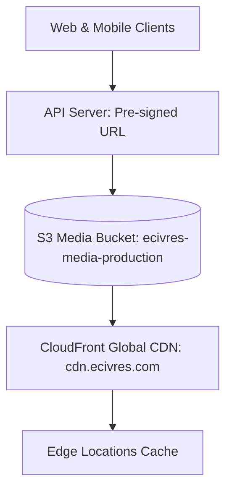

# CloudFront CDN & S3 Object Storage Architecture

## Overview
EcivreS delivers high-resolution before/after provider media, PDF invoices, and assets globally using Amazon S3 and Amazon CloudFront CDN.

## Security & Edge Optimization
- **Pre-signed S3 Upload URLs**: Client uploads directly to S3 with 15-minute expiration windows.
- **Signed CloudFront URLs**: Private documents (PDF invoices) require HMAC-SHA256 signed CloudFront tokens.
- **Cache Policy**: 30-day TTL for optimized WebP images, zero-cache policy for sensitive invoices.
