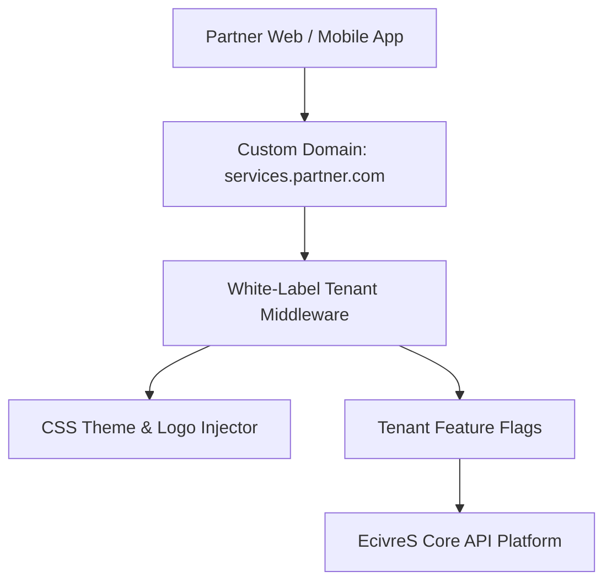

# White-Label Marketplace Architecture

## Overview
The EcivreS White-Label Platform allows multi-tenant enterprise partners to launch custom-branded service marketplaces with dedicated domains, custom CSS theme tokens, custom email templates, and selective feature toggles.

## Feature Toggle Matrix
- `enableArPreview`: Toggles 3D AR spatial room preview.
- `enableSplitPayments`: Enables multi-party bill splitting.
- `enableGamification`: Enables customer points, streaks, and VIP badge tiers.
