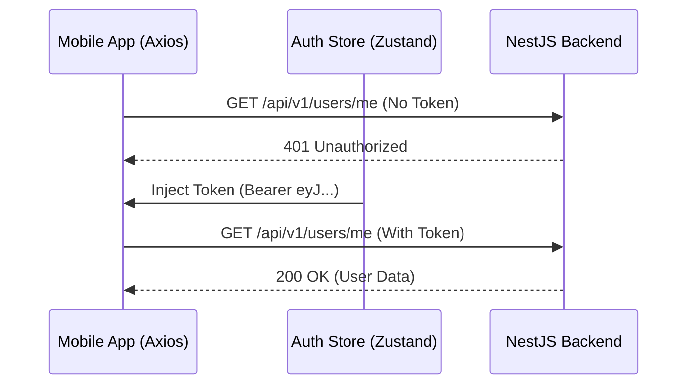
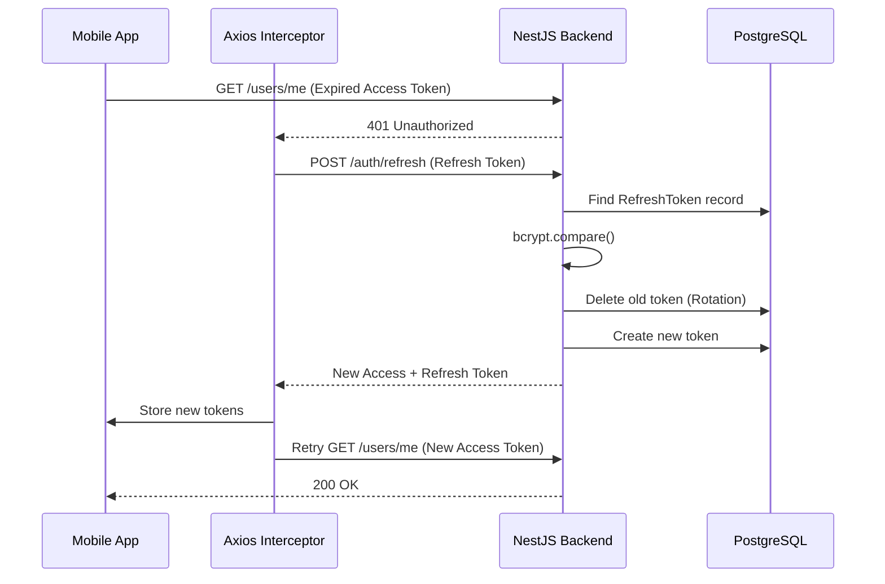

# Access and Refresh Token Flow

## Why do we need two tokens?
- **Access Tokens** grant access to the API but have a very short lifespan (e.g., 15 minutes). If stolen, the attacker only has access for a short window.
- **Refresh Tokens** have a long lifespan (e.g., 7 days) but can *only* be used to request new Access Tokens. If a user's session needs to be revoked, we delete the Refresh Token from the database.

## Complete Access Token Flow

1. The mobile app stores the token in `AsyncStorage`.
2. The `apiClient` (`apps/mobile/src/services/api/interceptors.ts`) intercepts every outgoing request and injects the `Authorization` header.
3. The NestJS `JwtAuthGuard` validates the token.

## Complete Refresh Token Flow

Refresh tokens are stored as **bcrypt hashes** in the PostgreSQL database (`RefreshToken` model). This prevents attackers from stealing usable tokens even if the database is compromised.

### Refresh Token Revocation
When a user logs out (`/auth/logout`), the backend finds their specific refresh token hash in the database and deletes it. This immediately kills their long-term session.

### "Not Verified" Notice
*Note: In the current backend implementation (`auth.service.ts`), token rotation strictly revokes the single token used for the refresh request. We do not currently implement "Refresh Token Reuse Detection" (revoking the entire token family if a reused token is detected).*
