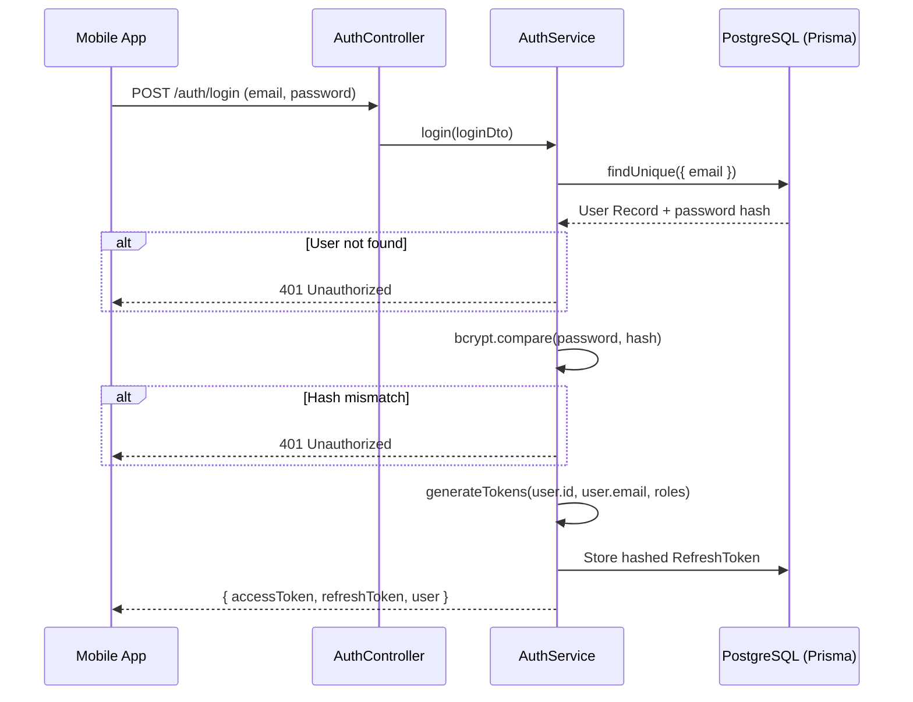

# Login & Register Flow

## Password Security
EcivreS NEVER stores plaintext passwords. We use `bcrypt` to hash passwords before storing them in the database. 
- Hashing is a one-way function. It cannot be reversed.
- We use a salt round of `10` to protect against rainbow table attacks.

## Registration Flow

When a user submits the registration form (`apps/mobile/src/screens/auth/RegisterScreen.tsx`):
1. **Validation**: The backend `RegisterDto` validates the payload (valid email, minimum password length).
2. **Conflict Check**: `AuthService.register()` checks if the email already exists in the `User` table.
3. **Hashing**: `bcrypt.hash(password, 10)` generates the hash.
4. **Transaction**: Prisma creates the `User` and a `CustomerProfile` simultaneously.
*(Note: In the current iteration, new users do not automatically get linked to the `UserRole` table due to the static identity model setup in `AuthService`, which defaults to creating a profile but skips explicit role mapping. This requires refactoring in the next phase.)*

## Login Flow

