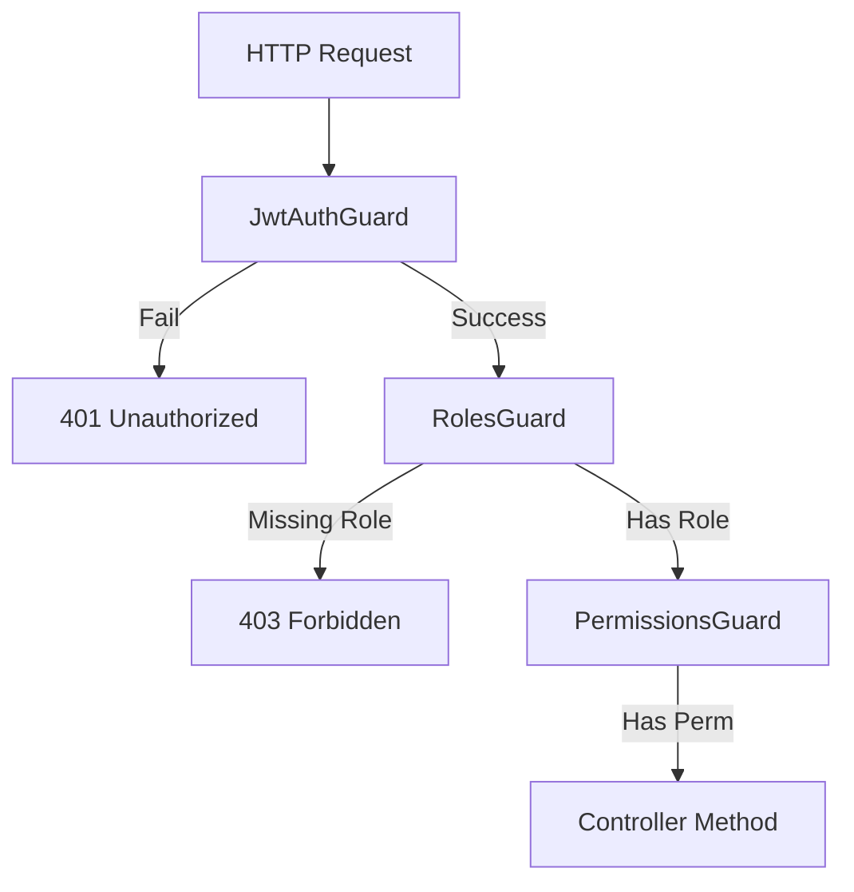

# RBAC and IDOR Prevention

## Role-Based Access Control (RBAC)

EcivreS implements a strict RBAC model utilizing four primary tables: `User`, `UserRole`, `Role`, and `RolePermission`.

### Current Implemented Roles
Based strictly on the database seeding script (`apps/api/prisma/seed.ts`), the following roles are actively implemented:
- `ADMIN`
- `CUSTOMER`
- `PROVIDER`

### The Authorization Flow
When a route is decorated with `@Roles('PROVIDER')`:
1. The request first passes through `JwtAuthGuard` which verifies the token and attaches `req.user`.
2. The `RolesGuard` then inspects `req.user.roles`.
3. If the user's role array includes `'PROVIDER'`, the request proceeds.
4. Otherwise, a `403 Forbidden` exception is thrown.



## IDOR Prevention

**Insecure Direct Object Reference (IDOR)** occurs when an application provides direct access to objects based on user-supplied input without verifying authorization.

**BAD Example:**
```typescript
@Patch(':userId/profile')
updateProfile(@Param('userId') userId: string, @Body() data: any) {
  // ❌ An attacker can pass ANY userId in the URL to edit someone else's profile!
  return this.service.update(userId, data); 
}
```

**EcivreS Implementation (GOOD):**
We NEVER trust client-supplied IDs for identity modification. Instead, we extract the identity directly from the cryptographically verified JWT payload using the `@CurrentUser()` decorator.

```typescript
// apps/api/src/common/decorators/current-user.decorator.ts
export const CurrentUser = createParamDecorator(
  (data: unknown, ctx: ExecutionContext) => {
    const request = ctx.switchToHttp().getRequest();
    return request.user; // This was attached by JwtStrategy!
  },
);

// In the controller:
@Patch('me/profile')
@UseGuards(JwtAuthGuard)
updateMyProfile(@CurrentUser() user: any, @Body() data: any) {
  // ✅ The user.id is extracted directly from the verified JWT token.
  // It is mathematically impossible for the user to forge this ID.
  return this.service.update(user.id, data);
}
```
