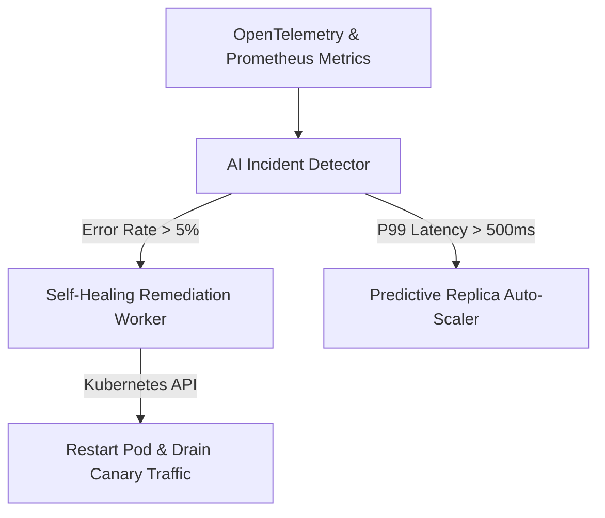

# Autonomous Operations Center Self-Healing Architecture

## Overview
The EcivreS Autonomous Operations Center provides real-time AI incident detection, automated container pod restart, traffic canary draining, and predictive infrastructure scaling to ensure 99.999% platform availability.

## Autonomous Operations API Endpoints
- **POST** `/api/v1/auto-ops/evaluate-incident` — Submit latency/error telemetry for AI incident triage.
- **POST** `/api/v1/auto-ops/execute-remediation` — Trigger self-healing automated pod restart/scaling.
