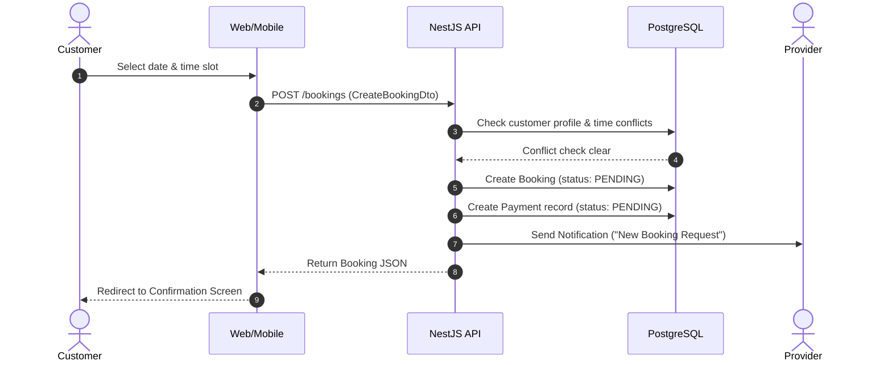

# Booking Creation Engine Specification

## 1. Overview
The Booking Creation Engine allows customers to select a service, choose a date and time window, provide optional delivery address and special instructions, and dispatch a reservation request to the provider.

## 2. Validation & Conflict Detection Rules
1. **Customer Profile Verification**: Ensures the authenticated user has an active customer profile before booking.
2. **Provider Availability Validation**: Validates that the requested date falls within the provider's operating hours.
3. **Time Slot Conflict Check**: Queries existing bookings for the target service at the same `scheduledAt` timestamp with status `PENDING`, `CONFIRMED`, or `IN_PROGRESS`. If a booking exists, a `BadRequestException` ("The selected time slot is already booked for this service") is thrown.

## 3. Workflow & Data Relationships

