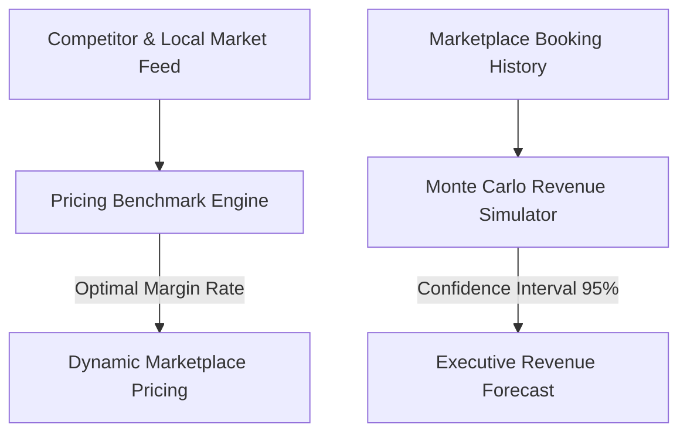

# Commerce Intelligence Forecasting & Revenue Simulation Architecture

## Overview
The EcivreS Commerce Intelligence Platform provides macroeconomic marketplace forecasting, competitor pricing benchmarks, dynamic margin optimization, and Monte Carlo revenue trajectory simulations for platform executives and enterprise partners.

## Commerce Intelligence API Endpoints
- **POST** `/api/v1/commerce-intel/simulate-revenue` — Run 12-month Monte Carlo growth revenue trajectory.
- **GET** `/api/v1/commerce-intel/competitor-benchmark` — Query market competitor price positioning & optimal rate.
