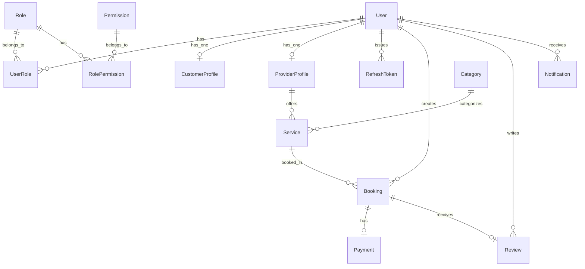

# Database Schema

The EcivreS database is a PostgreSQL instance entirely managed by Prisma.

## Entity Relationship Diagram

## Model Reference

### Users & Authentication
- **`User`**: Core identity model storing email and hashed password. It acts as the central hub linking to all other entities (profiles, roles, tokens, bookings).
- **`RefreshToken`**: Stores hashed refresh tokens to allow token rotation and revocation. Deletes cascade when a `User` is deleted.

### Roles & Permissions (RBAC)
- **`Role`**: Represents a user role (e.g., `ADMIN`, `CUSTOMER`, `PROVIDER`).
- **`Permission`**: Granular permissions (e.g., `create:service`, `delete:booking`).
- **`UserRole`** & **`RolePermission`**: Join tables implementing many-to-many relationships. This ensures a user can theoretically hold multiple roles, and roles can share permissions.

### Profiles
- **`CustomerProfile`**: Supplemental data for users operating as customers (firstName, lastName, phone).
- **`ProviderProfile`**: Supplemental data for users operating as service providers (businessName, description, address, verification status).

### Services & Marketplace
- **`Category`**: Broad categories grouping services (e.g., "Plumbing", "Cleaning").
- **`Service`**: A specific offering by a Provider. Belongs to a `Category` and a `ProviderProfile`. Contains pricing and duration.

### Transactions
- **`Booking`**: Links a Customer (`User`) to a `Service`. Uses a `BookingStatus` enum (`PENDING`, `CONFIRMED`, `IN_PROGRESS`, `COMPLETED`, `CANCELLED`).
- **`Payment`**: Tracks financial transactions linked to a `Booking`. Uses a `PaymentStatus` enum.
- **`Review`**: A 1-5 rating and comment left by an author (`User`) for a specific `Booking`.

## Scaffolded vs. Implemented Models
- **Fully Implemented/Used:** `User`, `Role`, `UserRole`, `CustomerProfile`, `RefreshToken`.
- **Scaffolded (Schema only, lacking API logic):** `ProviderProfile`, `Booking`, `Service`, `Category`, `Payment`, `Review`, `Notification`.
