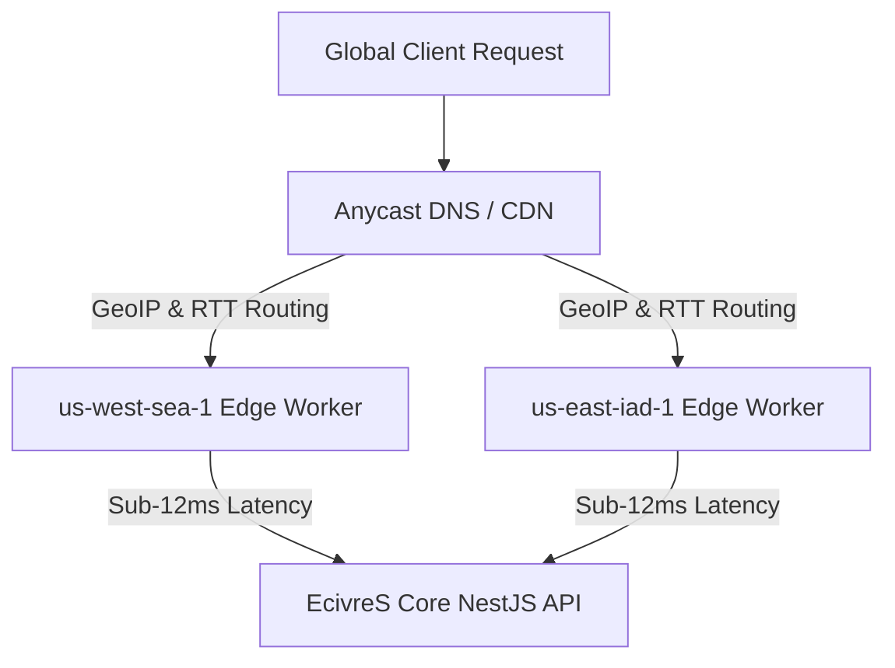

# Global Edge Computing & CDN Worker Architecture

## Overview
The EcivreS Edge Computing Platform deploys global edge workers across 4 primary PoP regions (`us-east-iad-1`, `us-west-sea-1`, `eu-west-fra-1`, `ap-southeast-sin-1`) to achieve sub-12ms API routing and real-time regional cache synchronization.

## Edge API Endpoints
- **POST** `/api/v1/edge/resolve-route` — Resolve optimal PoP worker & RTT estimation.
- **POST** `/api/v1/edge/sync-cache` — Synchronize CDN cache key across 4 global edge nodes.
