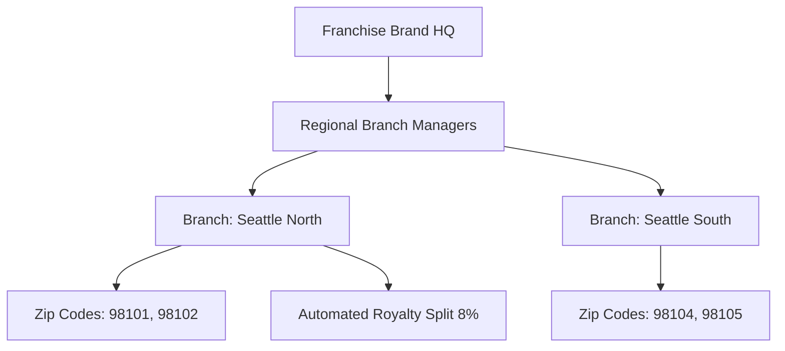

# Franchise Platform Network & Territory Architecture

## Overview
The EcivreS Franchise Platform allows enterprise regional service brands to manage franchisee onboarding, territory zip code fencing, branch compliance, and automated royalty revenue splitting.

## Franchise Endpoints
- **POST** `/api/v1/franchise/onboard` — Register new regional franchise brand.
- **POST** `/api/v1/franchise/territory` — Allocate exclusive zip code coverage territory.
- **GET** `/api/v1/franchise/royalty-split` — Calculate gross/net royalty revenue distribution.
