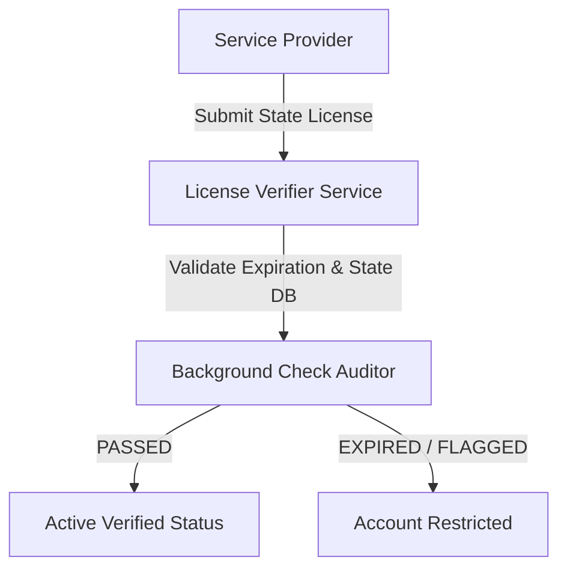

# Government & Municipal Compliance Verification Standards

## Overview
The EcivreS Government & Compliance Platform enforces automated trade licensing verification, background check clearances, and municipal safety regulation compliance before service providers can accept high-risk bookings.

## Government API Endpoints
- **POST** `/api/v1/government/verify-license` — Validate state trade license expiration & authority.
- **POST** `/api/v1/government/background-check` — Perform automated criminal background check audit.
