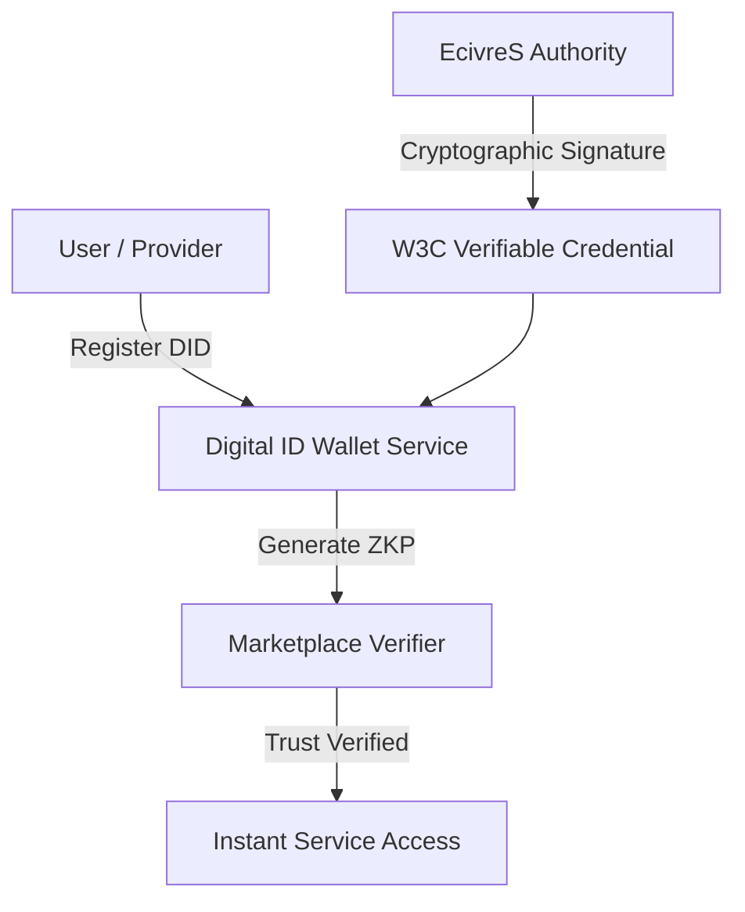

# Digital Identity & W3C Verifiable Credentials Architecture

## Overview
The EcivreS Digital Identity Platform implements W3C Decentralized Identifiers (DIDs) and Verifiable Credentials (VCs) to enable portable, tamper-evident identity verification, trade license credentials, and Zero-Knowledge Proof (ZKP) reputation scores.

## Identity Endpoints
- **POST** `/api/v1/identity/wallet` — Register Decentralized Identifier (DID) wallet.
- **POST** `/api/v1/identity/credentials` — Issue W3C signed Verifiable Credential.
- **GET** `/api/v1/identity/zk-reputation` — Verify Zero-Knowledge reputation score threshold.
