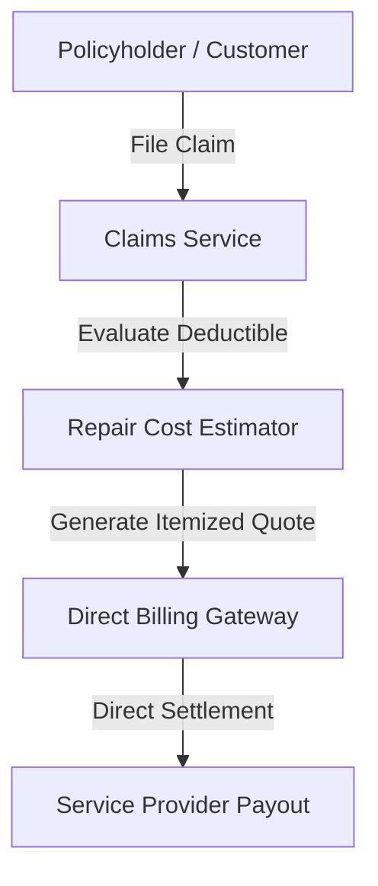

# Insurance Ecosystem Claims & Direct Billing Architecture

## Overview
The EcivreS Insurance Ecosystem enables customers, service providers, and insurance carriers to process claims, compute automated repair cost estimates, and perform direct insurer billing.

## Insurance API Endpoints
- **POST** `/api/v1/insurance/claims` — File new property damage claim.
- **POST** `/api/v1/insurance/repair-estimate` — Compute itemized labor & material estimate.
- **POST** `/api/v1/insurance/direct-bill` — Process carrier direct billing reimbursement.
