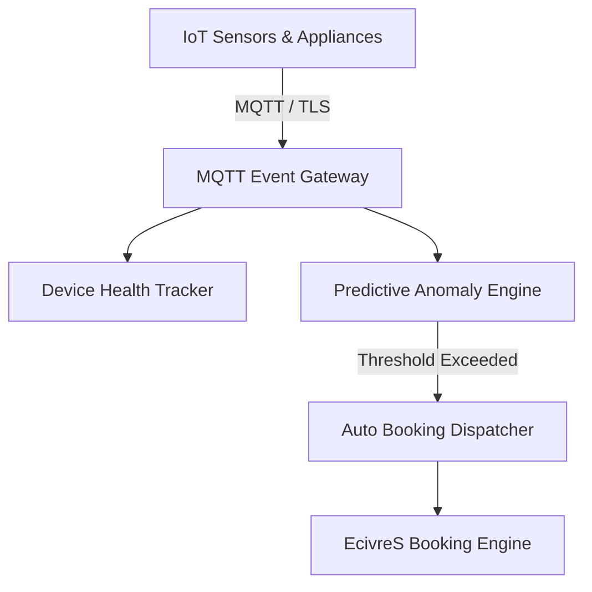

# IoT Service Automation Architecture

## Overview
The EcivreS IoT Module provides real-time MQTT gateway ingest, device heartbeat tracking, predictive maintenance anomaly detection, and automated booking dispatch.

## Supported Sensor Types
- **HVAC Sensors**: Temperature, humidity, pressure, coil vibration.
- **Smart Water Meters**: Flow rate, leak detection pressure drop.
- **Solar Inverters**: Current output, thermal overload alert.
- **Security Gateways**: Access logging, door sensor state.
