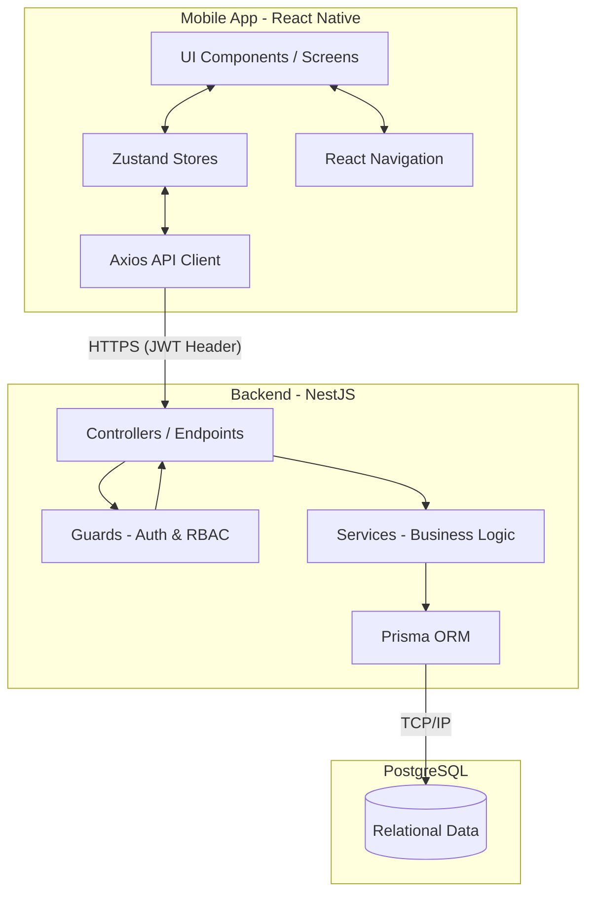

# EcivreS: Chunk 1 - Discovery & Architecture

This document covers **Phase 1 (Repository Discovery)**, **Phase 2 (Technology Map)**, and **Phase 3 (High-Level Architecture)** of the EcivreS codebase. We analyze what actually exists in the repository, debunking any outdated documentation, and providing a factual, textbook-level foundation.

---

## Phase 1 — Repository Discovery

EcivreS is built as a **Monorepo** using **pnpm workspaces**. This structure allows multiple independent applications (mobile app, backend API) to share configuration and potentially shared packages while remaining logically separated.

### High-Level Folder Tree

| File / Folder | Purpose | Important Details |
| --- | --- | --- |
| `apps/` | Contains the primary deployable applications. | Houses both `api` and `mobile`. |
| `apps/api/` | The NestJS backend application. | Contains business logic, database ORM, and REST endpoints. |
| `apps/mobile/` | The React Native mobile application. | The entry point for the user. Note: Built with bare React Native CLI, NOT Expo. |
| `packages/` | Shared libraries for the monorepo. | Contains `api-client`, `config`, `eslint-config`, `types`, and `validation`. |
| `package.json` | Monorepo root package file. | Defines global scripts (`dev`, `db:migrate`, `docker:up`). |
| `pnpm-workspace.yaml` | Workspace definition for pnpm. | Links `apps/*` and `packages/*` into a single dependency tree. |
| `docker-compose.yml` | Container orchestration. | Runs PostgreSQL and potentially Redis for local development. |
| `COMMANDS.md` | Developer command reference. | Contains helpful startup and debugging commands. |

### Identifying Documentation Drift
> [!WARNING]
> **Documentation Drift:** The root `README.md` claims the mobile app uses "Expo, Expo Router, NativeWind". **This is incorrect based on the actual codebase.** 
> The codebase actually uses **React Native CLI (0.87.0)** and **React Navigation (7.3.16)**. It does not use Expo or NativeWind. As a Senior Engineer, verifying claims against `package.json` and actual configuration files is step 1.

---

## Phase 2 — Technology Map

Here is the *actual* technology stack used in the EcivreS repository, confirmed by inspecting `package.json` and module imports.

### Mobile Frontend (`apps/mobile`)
*   **React Native (0.87.0):** The core framework for building native Android/iOS apps using React. EcivreS uses the "bare workflow" (React Native CLI), meaning we have full access to the `android/` and `ios/` native folders.
*   **React Navigation (7.3.16):** Used instead of Expo Router. The app uses `@react-navigation/native-stack` for native screen transitions. Found in `src/navigation/`.
*   **Zustand:** A small, fast, and scalable bearbones state-management solution. Used for global state like authentication (`authStore.ts`).
*   **Axios:** Promise-based HTTP client used to communicate with the NestJS backend.
*   **React Hook Form & Zod:** Used for form state management and schema-based validation.
*   **React Native Keychain:** Used for securely storing sensitive data like JWTs on the device's secure enclave/keystore, which is significantly more secure than `AsyncStorage`.

### Backend API (`apps/api`)
*   **NestJS (11.0.1):** A progressive Node.js framework for building efficient, reliable, and scalable server-side applications. It heavily relies on Decorators, Dependency Injection (DI), and modular architecture.
*   **Prisma (7.9.1):** Next-generation Node.js and TypeScript Object-Relational Mapper (ORM). Used to communicate with the PostgreSQL database. Defines the schema in `prisma/schema.prisma`.
*   **PostgreSQL:** The relational database used to store all application data (Users, Roles, Profiles, Bookings).
*   **Passport & JWT (`@nestjs/jwt`):** Used for robust authentication and securing endpoints.
*   **Class Validator & Class Transformer:** Used in NestJS DTOs (Data Transfer Objects) to validate incoming HTTP request payloads automatically before they reach the controller.

### DevOps & Monorepo
*   **pnpm:** A fast, disk space-efficient package manager. Essential for managing the monorepo workspace efficiently.
*   **Docker:** Used to easily spin up the database and backend environment without installing Postgres locally.

---

## Phase 3 — High-Level Architecture

EcivreS operates on a standard 3-Tier Client-Server Architecture, but heavily employs **Role-Based Access Control (RBAC)** to serve multiple user profiles (Customers and Providers) from a unified codebase.

### The Request Lifecycle (High-Level)
When a user performs an action (e.g., booking a service):
1.  **Mobile Component:** The user taps "Book". The React component calls a function.
2.  **State/API Call:** The function uses `axios` to send an HTTP POST request to the backend. It attaches a JWT (read from Keychain) in the `Authorization` header.
3.  **Backend Guard:** The NestJS `JwtAuthGuard` intercepts the request. It verifies the token. If the route is protected by roles, a `RolesGuard` checks if the user's role matches the required permission.
4.  **Backend Controller:** Once authorized, the Controller receives the validated payload and routes it to the specific Service method.
5.  **Backend Service:** The Service implements the business logic (e.g., check if the provider is available).
6.  **Prisma & Database:** The Service uses Prisma to execute SQL queries on PostgreSQL.
7.  **Response:** The result propagates back up the chain to the mobile app, where React re-renders the UI based on the response.

### Architectural Decisions
*   **Why a Monorepo?** By keeping `apps/mobile` and `apps/api` together, you can share TypeScript types (via the `packages/types` folder). When a backend DTO changes, the frontend immediately throws a compile error if it doesn't match, preventing runtime crashes.
*   **Why NestJS?** NestJS forces a heavily structured, opinionated architecture. Unlike Express where developers can put code anywhere, NestJS enforces Controllers, Services, and Modules. This makes the codebase predictable and easier to scale.
*   **Why React Native CLI instead of Expo?** While Expo is easier for beginners, React Native CLI provides absolute control over native modules (Java/Kotlin/Swift/Objective-C). Given the inclusion of `react-native-keychain` and a custom Android build system, the team opted for maximum flexibility.

---

*This concludes Chunk 1. Next, we will dive deep into the internals of the Mobile App and Backend in Chunk 2.*
