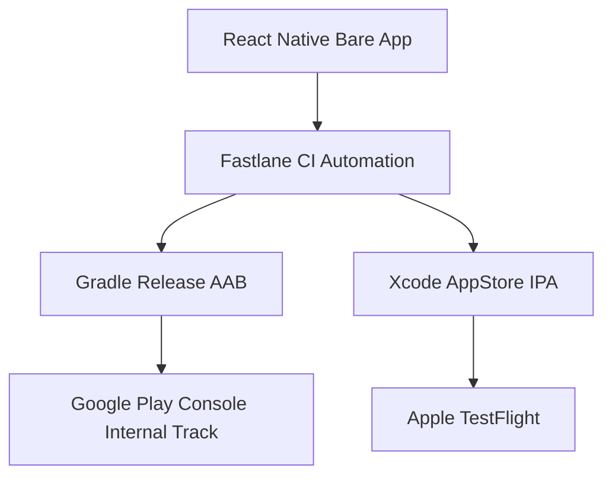

# Mobile Production Release Pipeline (Android & iOS)

## Automated Release Workflow
Mobile app builds are automated via Fastlane and GitHub Actions.

## Release Commands
- **Android Google Play Store Internal Deployment**: `cd apps/mobile && bundle exec fastlane android deploy_play_store`
- **iOS Apple TestFlight Deployment**: `cd apps/mobile && bundle exec fastlane ios deploy_testflight`
