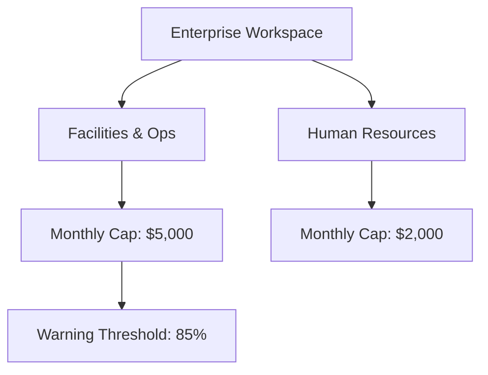

# Enterprise Multi-Tenant Workspace & Department Budget Controls

## Overview
EcivreS Enterprise Organizations provide multi-tenant isolation, department-level spending caps, approval workflows, and automated corporate invoicing for corporate clients.

## Architecture

## Budget Enforcement Workflow
1. When a booking request is initiated by a corporate employee, the `DepartmentBudgetService` checks the current monthly spend vs. allocated limit.
2. If spend exceeds 85%, a warning alert is flagged.
3. If spend exceeds 100%, the transaction is rejected with an HTTP 400 `BadRequestException`.
4. Workspace admins can dynamically update department caps via `PUT /api/v1/organizations/enterprise/department-budget`.
