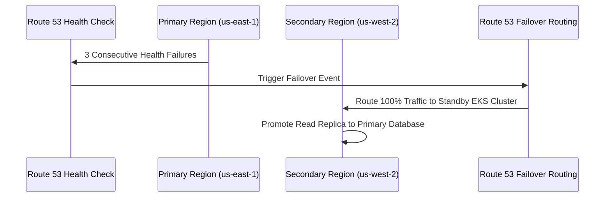

# Multi-Region Disaster Recovery & Emergency Failover Runbook

## Target RTO & RPO SLAs
- **Recovery Time Objective (RTO)**: ≤ 5 minutes
- **Recovery Point Objective (RPO)**: ≤ 30 seconds

## Failover Execution Workflow

## Emergency Procedures
1. **Promote Standby Database**: `aws rds promote-read-replica --id ecivres-postgres-uswest2`
2. **Update DNS Endpoint**: `aws route53 change-resource-record-sets --hosted-zone-id Z12345 --change-batch file://dr-dns-switch.json`
3. **Notify On-Call Response Team**: PagerDuty incident automatically generated.
