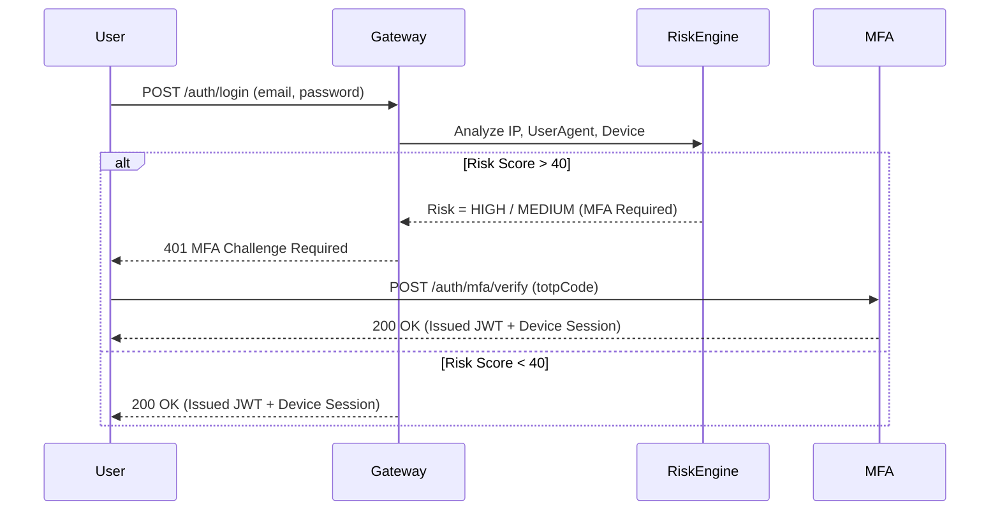

# MFA & Risk-Based Adaptive Security Architecture

## Multi-Factor Authentication (MFA)
EcivreS enforces TOTP (Time-based One-Time Password) MFA and WebAuthn Passkeys for all provider and administrative accounts.

## Active Device Session Management
- Users can view all logged-in devices (`GET /security/sessions`).
- Remote session revocation (`DELETE /security/sessions/:id`).
- Immutable administrative audit logs for all security-sensitive actions.
