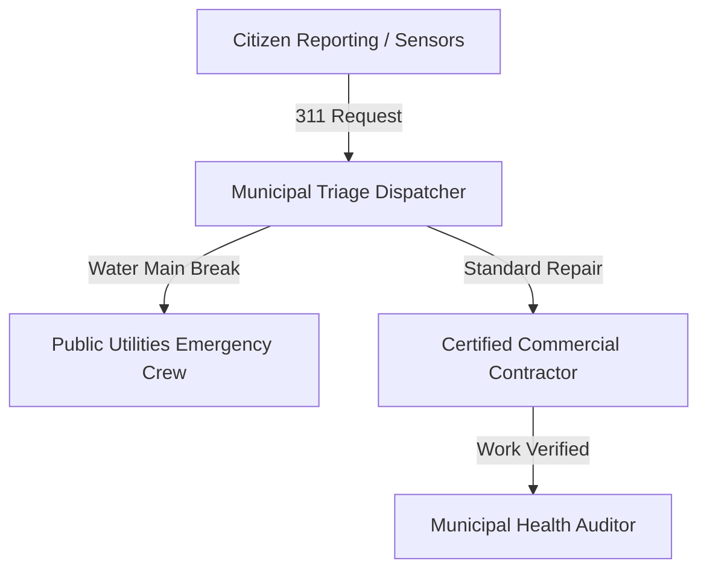

# Smart City Municipal Integration Architecture

## Overview
The EcivreS Smart City Integration Platform connects municipal public works departments, emergency services, and citizen reporting networks with certified contractors for public infrastructure repairs, water main emergencies, and street lighting maintenance.

## Smart City API Endpoints
- **POST** `/api/v1/smart-city/municipal-request` — Submit and triage 311 public works request.
- **GET** `/api/v1/smart-city/infrastructure-health` — Query city infrastructure health index & active alerts.
