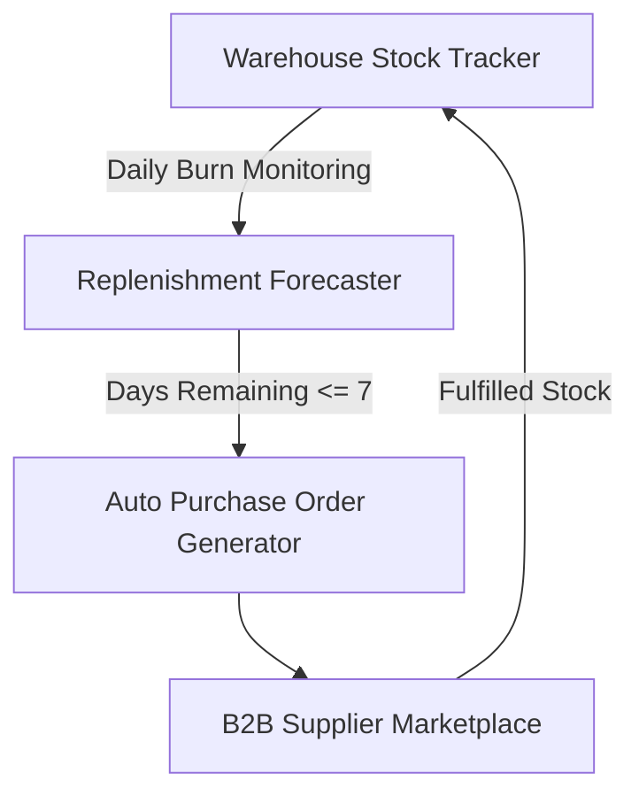

# Marketplace Supply Chain & Inventory Replenishment Architecture

## Overview
The EcivreS Supply Chain Module connects service providers directly with verified B2B equipment & parts suppliers, featuring automated purchase orders, warehouse inventory tracking, and lead-time replenishment forecasting.

## Supply Chain API Endpoints
- **POST** `/api/v1/supply-chain/suppliers` — Onboard B2B parts supplier.
- **POST** `/api/v1/supply-chain/purchase-orders` — Create warehouse purchase order.
- **GET** `/api/v1/supply-chain/replenishment-forecast` — Query stock burn rate & lead time.
