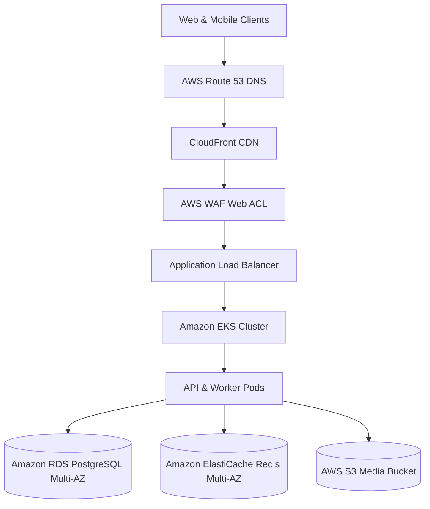

# AWS Production Infrastructure Architecture Guide

## Overview
EcivreS v4.0 Global Scale platform is provisioned on AWS using Terraform Infrastructure as Code (IaC).

## Infrastructure Specifications
1. **Networking (`terraform/vpc.tf`)**:
   - 3 Public Subnets across 3 Availability Zones (`us-east-1a`, `us-east-1b`, `us-east-1c`).
   - 3 Private Subnets for EKS Worker Nodes, RDS, and ElastiCache.
   - Elastic IP + NAT Gateway for outbound egress.

2. **Database (`terraform/rds.tf`)**:
   - PostgreSQL 15.4 on `db.m6g.xlarge` with Multi-AZ automatic failover.
   - 100 GB gp3 storage auto-scaling up to 1000 GB.
   - 30-day automated backup retention period with Point-in-Time Recovery (PITR).

3. **In-Memory Cache & Queue (`terraform/elasticache.tf`)**:
   - Redis 7.0 ElastiCache Cluster with Multi-AZ automatic failover.
   - Encryption at rest and in transit.

4. **Secrets & Config (`terraform/secrets.tf`)**:
   - AWS Secrets Manager for database credentials and JWT secrets.
   - SSM Parameter Store for environment variables.
